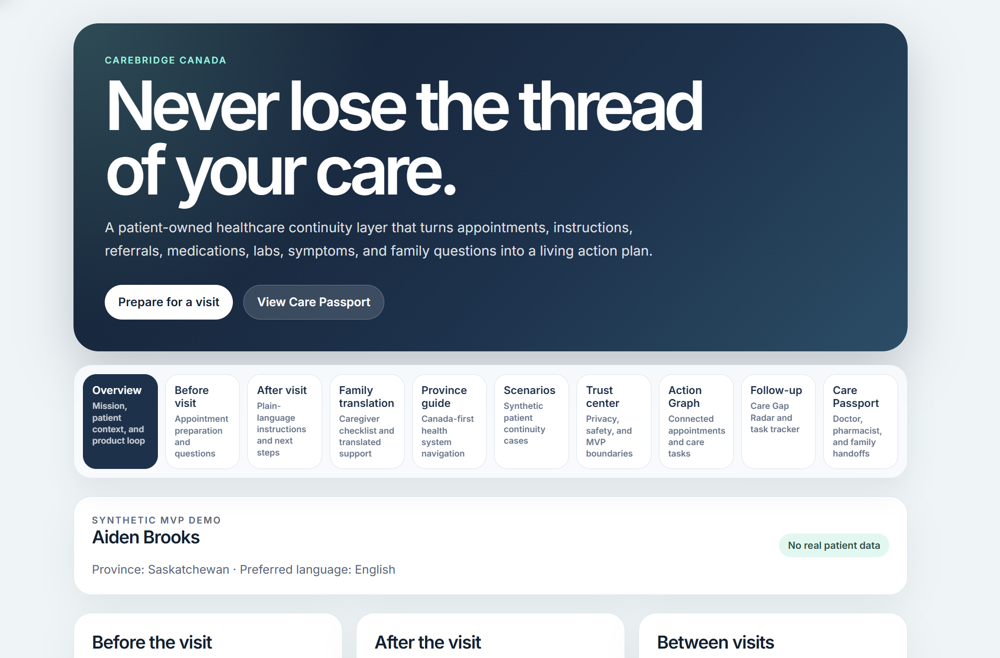
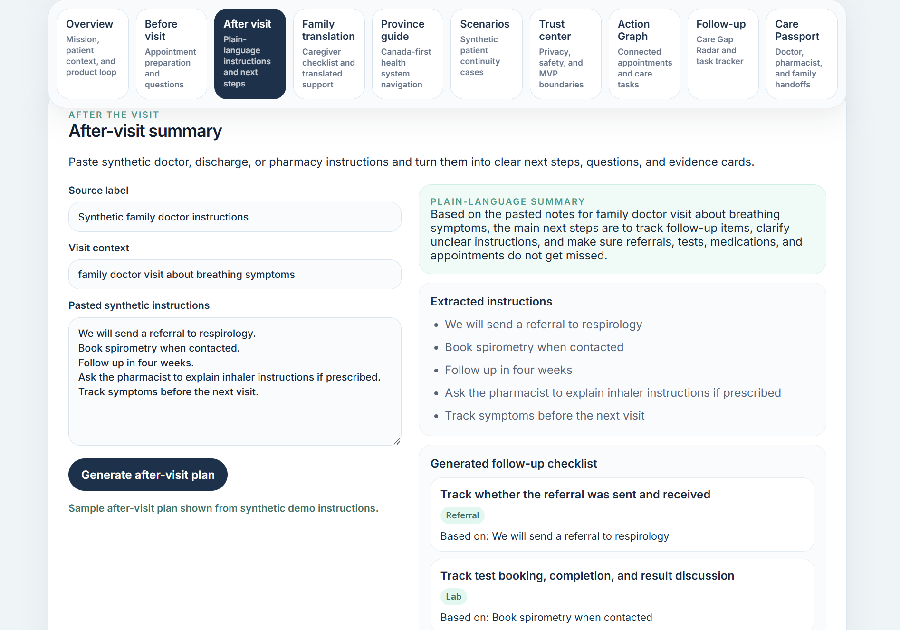
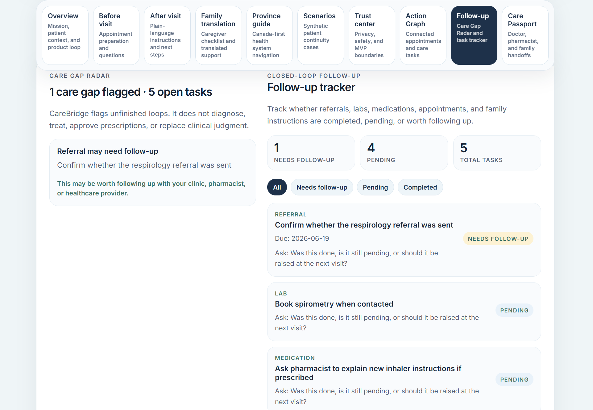
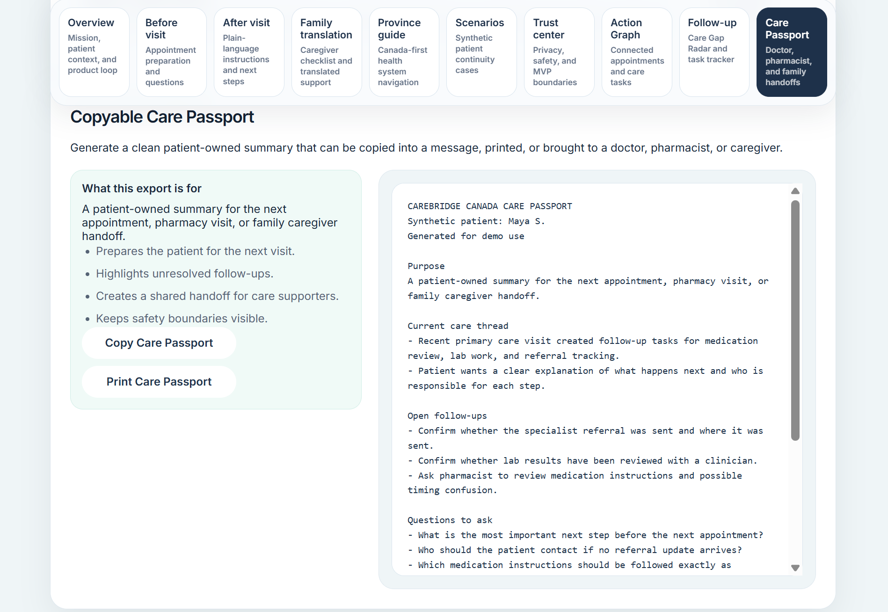

# CareBridge Canada


**Live demo:** https://kushrishi.github.io/carebridge-canada/

## Never lose the thread of your care.

CareBridge Canada is a patient-owned healthcare continuity platform concept that helps Canadians prepare for appointments, understand care instructions, track follow-ups, support family caregivers, and generate clinician-ready handoff summaries.

The project demonstrates how a healthcare-continuity assistant could help patients and families turn scattered care information into clear next steps while staying within strict safety boundaries.

CareBridge is not an AI doctor. It does not diagnose, prescribe, approve treatment, provide emergency triage, or replace doctors, nurses, pharmacists, clinics, hospitals, emergency services, or provincial health portals.

---

## Product thesis

**Health portals show information. CareBridge turns information into action.**

Many patients leave healthcare visits with fragmented instructions, pending referrals, unclear follow-ups, medication questions, language barriers, or family members who need to help but do not have a clear summary.

CareBridge Canada is designed as a continuity layer between visits. It helps patients organize the thread of care by converting instructions, appointments, referrals, labs, medications, and family questions into a patient-owned action system.

---

## Current MVP

The current MVP is a frontend prototype built with React, TypeScript, Vite, Vitest, React Testing Library, GitHub Actions, and GitHub Pages.

The public demo uses synthetic data only.

The MVP does not use real patient data, real provincial portal data, a backend, a database, or an external AI API. Current summary generation is deterministic and rules-based through TypeScript utility functions. A future AI/RAG layer is described in the architecture documentation, but it is not active in the public demo.

---

## Screenshots

### Overview dashboard



### After-visit summary and evidence trace



### Follow-up tracker and Care Gap Radar



### Copyable Care Passport



---

## Implemented features

### Appointment preparation

Turns patient concerns, symptom timelines, medication notes, and questions into a structured doctor-ready visit summary.

Includes:

* appointment type
* main concern
* symptom timeline
* medication notes
* recent changes
* top questions
* generated 30-second summary
* appointment preparation reminders
* safety boundary language

### After-visit summary

Converts pasted synthetic doctor, discharge, or pharmacy instructions into organized next steps.

Includes:

* plain-language summary
* extracted instructions
* generated follow-up checklist
* questions to ask
* evidence cards
* safety reminder
* generation-state feedback

### Care task evidence trace

Shows how source instructions become generated follow-up tasks.

Each trace connects:

* source instruction
* generated task
* reason the task exists
* safety boundary

This supports the future product requirement that healthcare-adjacent outputs must be source-grounded and explainable.

### Family translation mode

Creates caregiver-friendly summaries and simulated translated checklists.

Current simulated language options:

* Punjabi
* Hindi
* French
* Urdu

The original source text remains visible beside the simplified family version.

### Province-aware navigator

Provides Canada-first preparation guidance for:

* British Columbia
* Alberta
* Saskatchewan
* Ontario
* Quebec

The navigator helps patients prepare for appointments, referrals, labs, imaging, records, and moving between provinces.

### Synthetic scenario library

Includes realistic synthetic patient-continuity situations such as:

* newcomer family preparing for a clinic visit
* older adult with family caregiver support
* patient moving between provinces
* patient unsure what to do after a visit

### Trust and safety center

Explains the MVP data boundary, clinical safety boundary, patient-owned continuity principles, family/translation safety, and production-readiness requirements.

### Safety rules engine

Defines explicit product safety rules for the care-continuity lane.

Rules include:

* no diagnosis
* no treatment recommendation
* no prescription approval
* no emergency triage
* human confirmation required

The rules engine includes tested logic for blocking unsafe request categories and suggesting safer alternatives.

### Action Graph timeline

Shows how appointments and follow-up tasks are connected into a care thread.

The Action Graph links:

* appointments
* referrals
* tests/labs
* medication questions
* family support tasks
* follow-up tasks

### Follow-up tracker and Care Gap Radar

Highlights unfinished loops and pending next steps.

The tracker supports:

* all tasks
* needs-follow-up tasks
* pending tasks
* completed tasks

### Care Passport

Generates patient-owned handoff summaries for:

* doctors
* pharmacists
* family caregivers
* the patient’s own records

The Care Passport helps patients bring a clean summary to a doctor, pharmacist, specialist, walk-in clinic, emergency department, or family caregiver.

### Copyable and printable Care Passport

Includes a clean export-ready Care Passport that can be copied or printed.

The print layout is optimized to focus on the export-ready patient summary rather than printing the full application view.

### Copy-ready caregiver message

Creates a short family-friendly note that a patient can copy and send to a caregiver.

The message explains what the patient may need help remembering while keeping medical decisions with qualified professionals.

### Summary generation transparency

Explains that the current public MVP uses:

* synthetic data
* deterministic TypeScript rules
* no real patient data
* no backend
* no active AI model
* no medical decision-making

It also outlines how a future AI/RAG version would require source grounding, safety rules, and audit logs.

---

## Safety boundaries

CareBridge Canada is intentionally designed with strict healthcare safety boundaries.

It does not:

* diagnose symptoms or conditions
* recommend treatment
* approve, reject, start, stop, or change prescriptions
* interpret test results as medical advice
* provide emergency triage
* replace doctors, nurses, pharmacists, hospitals, clinics, or emergency services
* claim integration with provincial portals
* store real patient data in the MVP

It does:

* organize patient-owned notes
* prepare questions for appointments
* summarize instructions in plain language
* preserve original source text beside generated summaries
* track follow-up tasks
* support caregiver communication
* create clinician/pharmacist/caregiver handoffs
* remind users to confirm medical decisions with qualified healthcare professionals

---

## Why this matters

Patients often fall through the cracks not because no information exists, but because the next step is unclear.

CareBridge focuses on continuity problems such as:

* “What did the doctor tell me to do?”
* “What should I ask at my next appointment?”
* “Was the referral actually sent?”
* “Who is supposed to call next?”
* “Did someone explain the lab or imaging result?”
* “What should I ask the pharmacist?”
* “How do I help my parent understand their care plan?”
* “What should I bring when I move provinces or see a new provider?”

---

## Current MVP vs future startup version

| Area                 | Current MVP                          | Future startup version                                        |
| -------------------- | ------------------------------------ | ------------------------------------------------------------- |
| Data                 | Synthetic demo data only             | Patient-owned real data only after privacy/security readiness |
| Backend              | None                                 | Secure authenticated backend                                  |
| Database             | None                                 | Encrypted database                                            |
| AI                   | None active                          | Source-grounded AI/RAG only after safety review               |
| Summary generation   | Deterministic TypeScript rules       | Rules + possible AI/RAG + audit logs                          |
| Safety               | Visible disclaimers and tested rules | Rules engine, review pipeline, audit logs                     |
| Export               | Copy and print demo                  | PDF, share links, data export                                 |
| Caregiver sharing    | Copy-ready message                   | Consent-based sharing                                         |
| Province integration | Guidance only                        | Only real integrations if legally and technically approved    |
| Deployment           | GitHub Pages                         | Secure production infrastructure                              |

---

## Technical stack

Current implementation:

* React
* TypeScript
* Vite
* Vitest
* React Testing Library
* GitHub Actions CI
* GitHub Pages deployment

Potential future architecture:

* FastAPI or Node/Express backend
* PostgreSQL persistence
* authentication and consent model
* encrypted storage
* audit logs
* rules engine
* source-grounded AI/RAG over patient-owned notes
* PDF export
* PWA/mobile support
* privacy and security review before real patient data

---

## Project structure

```txt
src/
  components/        Product UI sections
  data/              Synthetic demo care graph
  test/              Test setup
  types/             Shared TypeScript types
  utils/             Deterministic care logic, summaries, rules, and task generation

docs/
  assets/            README screenshots and visual project assets
  action-graph.md
  architecture.md
  privacy-and-data-principles.md
  problem-research.md
  problem-statement.md
  product-thesis.md
  roadmap.md
  safety-boundaries.md
  synthetic-personas.md
  validation-plan.md
  v1-release-notes.md
```

---

## Documentation

Project documentation:

* [Problem statement](docs/problem-statement.md)
* [Product thesis](docs/product-thesis.md)
* [Problem research brief](docs/problem-research.md)
* [Architecture documentation](docs/architecture.md)
* [Action Graph model](docs/action-graph.md)
* [Safety boundaries](docs/safety-boundaries.md)
* [Privacy and data principles](docs/privacy-and-data-principles.md)
* [Synthetic personas](docs/synthetic-personas.md)
* [Validation plan](docs/validation-plan.md)
* [Roadmap](docs/roadmap.md)
* [v1.0 release notes](docs/v1-release-notes.md)

---

## Validation and tests

The project includes automated tests for:

* app shell and navigation
* appointment preparation
* after-visit summarization
* care task evidence trace
* family translation mode
* province guidance
* synthetic scenario library
* trust center
* safety rules engine
* care timeline generation
* follow-up tracking
* Care Passport handoff summaries
* export-ready Care Passport
* caregiver message export

Run locally:

```bash
npm install
npm test
npm run build
npm run dev
```

PowerShell on Windows:

```powershell
npm.cmd install
npm.cmd test
npm.cmd run build
npm.cmd run dev
```

Local demo:

```txt
http://localhost:5173/carebridge-canada/
```

GitHub Actions automatically runs tests and builds the app on every push.

---

## Startup direction

CareBridge Canada is currently a portfolio-grade MVP and startup concept.

The long-term startup direction is a patient-owned care continuity assistant focused on after-visit continuity for patients and caregivers.

The safest first wedge is:

**After-visit continuity for patients and caregivers.**

The first real product should focus on:

* after-visit instruction organization
* follow-up task tracking
* source-grounded evidence traces
* Care Passport exports
* caregiver messages
* pharmacist-ready medication questions
* strict safety boundaries
* privacy-by-design architecture

The product should not start as a diagnosis app, symptom checker, treatment engine, prescription approval tool, or emergency triage system.

---

## Roadmap

Near-term project milestones:

1. Continue mobile and accessibility polish
2. Improve visual polish for future “coming soon” states
3. Explore a full-stack synthetic backend prototype
4. Prototype source-grounded AI/RAG using synthetic notes only
5. Prepare for lightweight user discovery and startup validation

Future startup-oriented milestones:

1. Full-stack synthetic backend prototype
2. Secure authentication and consent model
3. Encrypted database design
4. Audit logs
5. Source-grounded AI/RAG prototype using synthetic notes only
6. PDF export and patient-owned data export
7. Privacy/security/legal review before any real patient data
8. Lightweight user discovery and prototype testing
9. Closed alpha only after compliance and safety foundations are ready

---

## Disclaimer

CareBridge Canada is a software prototype for healthcare continuity, organization, and communication support.

It is not a medical device, clinical decision system, diagnostic tool, treatment tool, prescription tool, emergency triage tool, or substitute for professional medical advice.

The public MVP uses synthetic data only and does not connect to provincial portals, clinical systems, pharmacies, hospitals, or real patient records.
