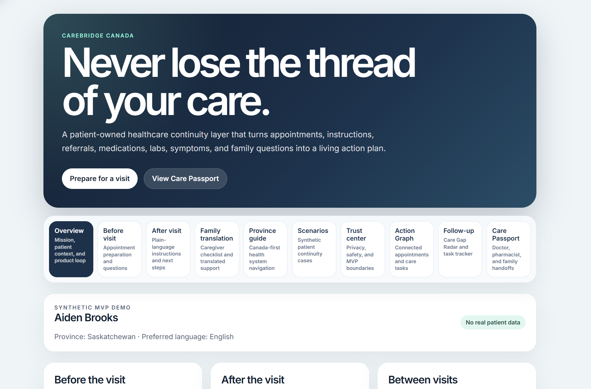
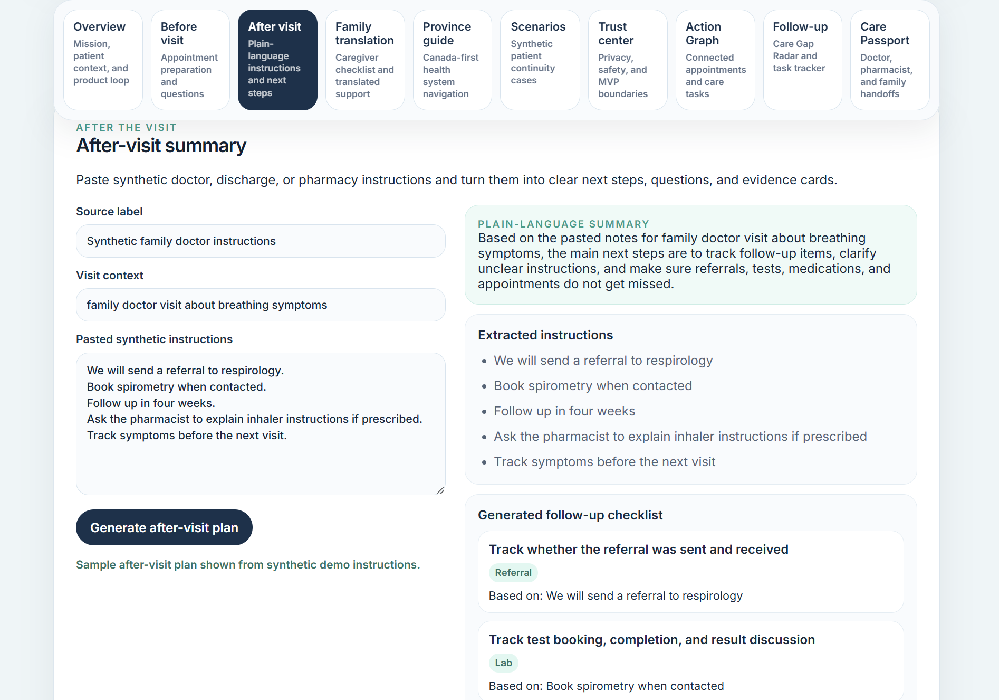
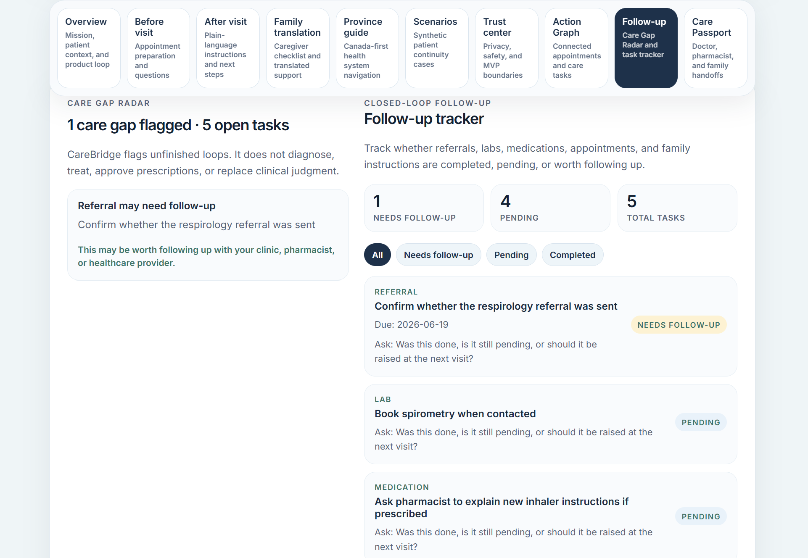
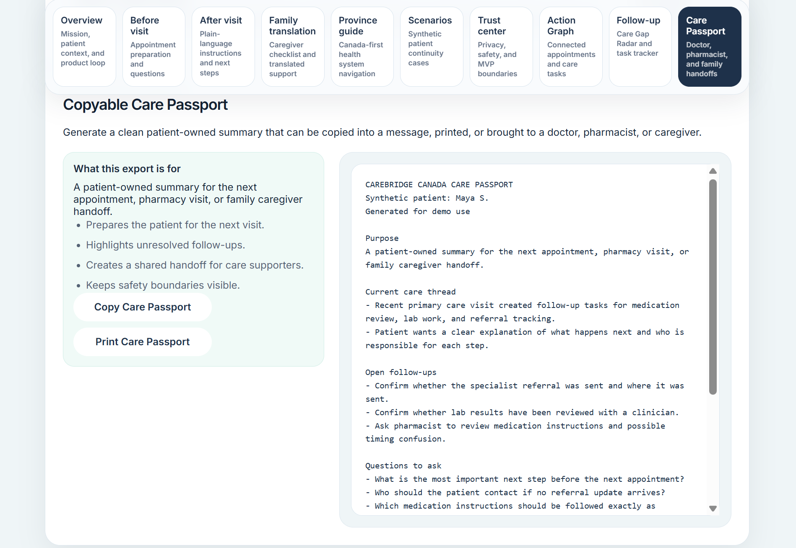

# CareBridge Canada


**Live demo:** https://kushrishi.github.io/carebridge-canada/

## Never lose the thread of your care.

CareBridge Canada is a healthcare-continuity prototype exploring how patients and caregivers could turn scattered care information into clearer next steps, follow-ups, and handoff summaries.

The public demo is intentionally narrow: it uses **synthetic data only**, runs entirely in the browser, and uses deterministic TypeScript logic rather than a live AI model. It does not connect to provincial portals, clinical systems, pharmacies, hospitals, or real patient records.

CareBridge is not a medical device or clinical decision system. It does not diagnose, recommend treatment, approve prescriptions, or provide emergency triage.

---

## What the public demo shows

The current React/TypeScript demo focuses on a few continuity workflows:

- **Appointment preparation** — organize concerns, timelines, medication notes, and questions before a visit.
- **After-visit organization** — turn synthetic visit instructions into plain-language next steps and follow-up tasks.
- **Evidence traces** — preserve the source instruction behind generated follow-up items.
- **Follow-up tracking** — surface pending, completed, and unresolved care tasks.
- **Care Passport handoffs** — create copyable summaries for patients, caregivers, doctors, and pharmacists.
- **Caregiver support** — create family-friendly summaries and reminders while keeping clinical decisions with healthcare professionals.
- **Province-aware guidance** — provide preparation guidance for selected Canadian provinces without claiming live integration.

The public demo is a product concept, not a production healthcare application.

---

## Public demo vs. private prototype

This repository contains the **public concept demo**.

A separate private full-stack prototype explores the deeper system architecture behind CareBridge, including FastAPI backend workflows, SQLite/SQLAlchemy persistence, source-note retrieval, audit trails, structured outputs, backend-only model-provider controls, and bounded AI workflow experiments.

The two repositories are deliberately separate:

| Public `carebridge-canada` | Private startup lab |
| --- | --- |
| React + TypeScript | React + FastAPI |
| Synthetic browser demo | Synthetic full-stack prototype |
| Deterministic logic | Retrieval, provider abstractions, audit trails |
| No backend or database | SQLite/SQLAlchemy persistence |
| No active external AI | Backend-only gated model path |
| Product concept and public technical evidence | Architecture and evaluation work |

The private prototype **explores and tests** the architecture; it is not presented as production validation or clinical evidence.

---

## Screenshots

### Overview dashboard



### After-visit summary and evidence trace



### Follow-up tracker and Care Gap Radar



### Copyable Care Passport



---

## Design principles

### Source before summary

Healthcare-adjacent outputs should remain traceable to the information that produced them. The demo keeps source instructions visible beside derived follow-up items and summaries.

### Continuity, not diagnosis

CareBridge focuses on organization, preparation, communication, and follow-up. Clinical judgment remains with patients and qualified healthcare professionals.

### Synthetic by default

The public project contains no real patient data. Real-data handling, authentication, consent, security, privacy review, and regulated deployment are intentionally outside the current scope.

### Patient and caregiver usability

The interface is designed around concrete tasks: preparing for a visit, remembering what happened, tracking what remains unresolved, and carrying a clean summary to the next person involved in care.

---

## Technical implementation

The public implementation uses:

- React
- TypeScript
- Vite
- Vitest
- React Testing Library
- GitHub Actions CI
- GitHub Pages

The application uses deterministic utilities for summarization, task generation, safety rules, and synthetic continuity workflows. There is no active external model call in this repository.

Project structure:

```text
src/
  components/        Product UI sections
  data/              Synthetic demo care graph
  test/              Test setup
  types/             Shared TypeScript types
  utils/             Deterministic care logic, summaries, rules, and task generation

docs/
  assets/            README screenshots and visual project assets
  action-graph.md
  architecture.md
  privacy-and-data-principles.md
  problem-research.md
  problem-statement.md
  product-thesis.md
  roadmap.md
  safety-boundaries.md
  synthetic-personas.md
  validation-plan.md
  v1-release-notes.md
```

---

## Safety boundary

The public prototype may:

- organize patient-owned notes;
- prepare questions for appointments;
- summarize synthetic instructions in plain language;
- preserve source text beside derived outputs;
- track follow-up tasks;
- support caregiver communication; and
- create handoff summaries.

It may not:

- diagnose symptoms or conditions;
- recommend or select treatment;
- start, stop, approve, or change prescriptions;
- interpret tests as medical advice;
- provide emergency triage;
- claim live integration with healthcare systems; or
- store real patient data.

---

## Validation and tests

The repository includes automated tests for the application shell, appointment preparation, after-visit workflows, evidence traces, province guidance, safety rules, care timelines, follow-up tracking, Care Passport output, and caregiver exports.

Run locally:

```bash
npm install
npm test
npm run build
npm run dev
```

GitHub Actions runs tests and builds the application on pushes.

---

## Documentation

More detailed product and engineering notes live under `docs/`:

- [Problem statement](docs/problem-statement.md)
- [Product thesis](docs/product-thesis.md)
- [Problem research brief](docs/problem-research.md)
- [Architecture](docs/architecture.md)
- [Action Graph model](docs/action-graph.md)
- [Safety boundaries](docs/safety-boundaries.md)
- [Privacy and data principles](docs/privacy-and-data-principles.md)
- [Synthetic personas](docs/synthetic-personas.md)
- [Validation plan](docs/validation-plan.md)
- [Roadmap](docs/roadmap.md)
- [v1.0 release notes](docs/v1-release-notes.md)

---

## Current direction

CareBridge is currently a **synthetic product prototype and startup hypothesis**, not a launched healthcare product.

The next technical work is happening in the private prototype and is focused on evaluating bounded, source-grounded tool use rather than adding more public-demo features. The broader startup thesis remains intentionally unfrozen while customer discovery tests which continuity problems are frequent, costly, and poorly served by existing workflows.

The public repository should remain stable unless a future technical result materially changes what is worth showing.

---

## Copyright and disclaimer

Copyright © 2026 Kush Rishi. All rights reserved.

This repository is published as a product-concept and technical demonstration. No license is granted for copying, distributing, modifying, sublicensing, or commercializing the code, documentation, branding, design, or written materials without permission.

CareBridge Canada is a software prototype for healthcare continuity, organization, and communication support. It is not a medical device, diagnostic tool, treatment tool, prescription tool, emergency-triage system, or substitute for professional medical advice.